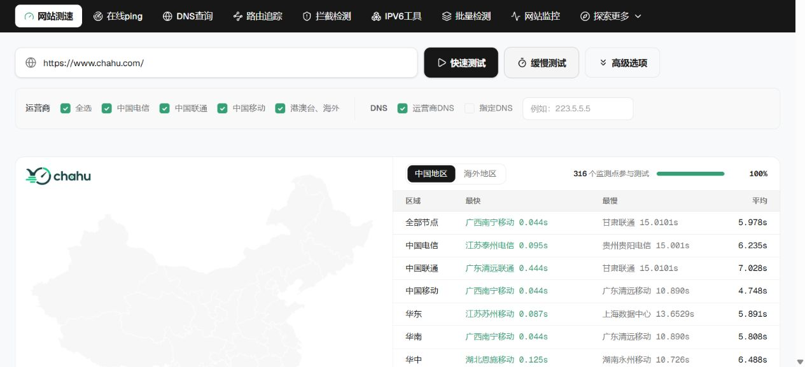
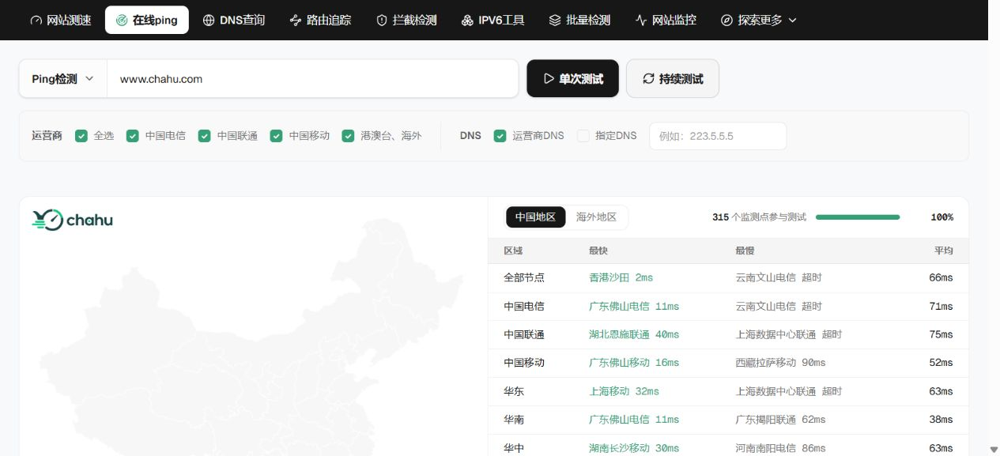
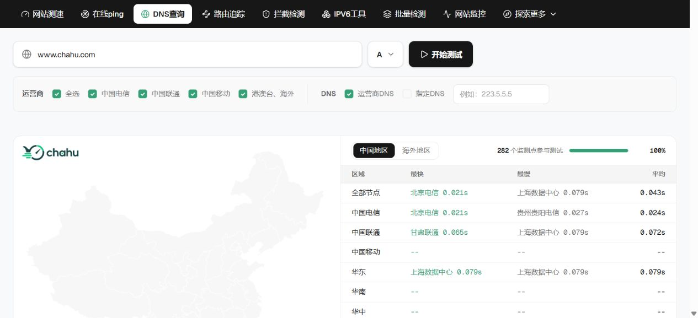
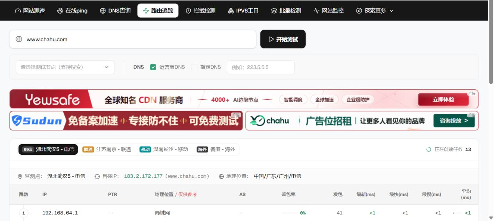
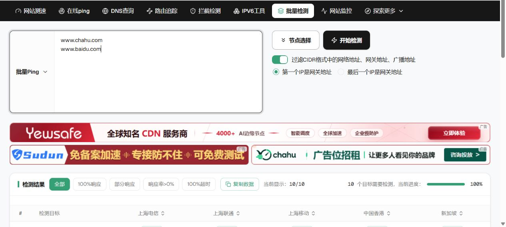

# 网站测速工具推荐与测评：茶壶测速 Chahu.com 七项核心功能全面实测

> 测试日期：2026-09-11（UTC+8） 
> 测试对象：[茶壶测速 Chahu.com](https://www.chahu.com/) 
> 在线文章：[https://chahucesu.github.io/chahu-speedtest-review/](https://chahucesu.github.io/chahu-speedtest-review/)

## 结论

茶壶测速值得站长、运维、SRE、CDN 和 SEO 技术团队试用，特别适合需要观察中国电信、中国联通、中国移动以及港澳台、海外访问差异的场景。

本次综合评分为 **8.7 / 10**。它的核心价值不是给出单一速度数字，而是将网站测速、Ping、DNS、路由、拦截、IPv6 和批量检测组织成一套从现象到根因的诊断流程。

主要优势：

- 国内三网与地区节点覆盖密集。
- HTTP 结果可拆分 DNS、连接、下载、重定向和状态码。
- Ping、解析 IP 分布、路由 AS 与逐跳数据可以联合判断。
- 公开目标无需安装客户端即可开始检测。

需要改进：

- 汇总指标应同时展示 P50、P95 与有效样本数。
- DNS 本轮超时节点较多，结果解释需要更明确。
- 批量检测任务已受理，但本轮实时结果流没有在 50 秒内返回。
- 页面广告较密集，会分散对检测结果的注意力。

## 测试方法

主要目标为 `www.chahu.com`，IPv6 项目使用具有 AAAA 记录的 `www.cloudflare.com`。默认选择电信、联通、移动、港澳台及海外线路，DNS 使用运营商 DNS 与 A 记录。

网络数据具有时间性，本文数字属于单次真实样本，不代表长期 SLA，也不替代持续监控、RUM、APM 或服务器日志。

## 七项工具总览

| 工具 | 本轮目标 | 关键结果 | 结论 |
| --- | --- | --- | --- |
| [网站测速](https://www.chahu.com/) | www.chahu.com | 316 节点；最快 0.044s；平均 5.978s | 分阶段 HTTP 数据完整 |
| [在线 Ping](https://www.chahu.com/ping) | www.chahu.com | 315 节点；最快 2ms；平均 66ms | 国内三网诊断能力突出 |
| [DNS 查询](https://www.chahu.com/dns) | www.chahu.com | 识别 2 个 A 记录；响应样本平均 43ms | 解析分布有用，有效样本率需关注 |
| [路由追踪](https://www.chahu.com/trace) | www.chahu.com | 武汉电信至目标 13 跳；末跳平均 23ms | 逐跳 AS、位置和丢包信息专业 |
| [拦截检测](https://www.chahu.com/block) | www.chahu.com | 正常；状态 safe；代码 0 | 适合作为故障分流入口 |
| [IPv6 工具](https://www.chahu.com/ipv6) | www.cloudflare.com | 94 个预期节点；4 个节点 HTTP 200 | 能暴露 IPv6 路径差异 |
| [批量检测](https://www.chahu.com/batch) | 2 域名 x 2 节点 | 任务受理；实时流 50 秒内未返回 | 功能设计完整，稳定性需复测 |

## 1. 网站测速

快速测试覆盖 316 个节点。广西南宁移动最快为 0.044 秒，甘肃联通最慢为 15.0101 秒；电信、联通、移动平均分别为 6.235 秒、7.028 秒和 4.748 秒，港澳台平均 2.068 秒。

平均值被部分连接或下载阶段接近超时的节点明显拉高，因此不能把 5.978 秒直接理解为所有用户的页面打开时间。详细表格可继续查看解析、连接、下载、重定向、HTTP 状态和响应头，这是该工具最有价值的部分。

## 2. 在线 Ping

本轮共有 315 个节点参与，全部节点平均 66ms，香港沙田最快 2ms。三网平均为电信 71ms、联通 75ms、移动 52ms。

结果页同时展示地区地图、三网汇总、逐节点延迟、网络质量和解析 IP 占比。本轮两个响应 IP 分布接近各一半，可用于检查负载均衡或 DNS 调度。

## 3. DNS 查询

平台识别到 `154.38.98.137` 与 `154.38.98.150` 两个 A 记录，并展示节点实际使用的递归 DNS。响应样本最快 21ms，汇总平均 43ms。

本轮 282 个参与节点中有 274 个显示超时。这个结果不能直接证明目标域名 DNS 故障，因为同时进行的网站测速和 Ping 可以正常解析并访问。更严谨的结论是本轮 DNS 任务有效响应率偏低，需要复测和权威 DNS 交叉验证。

## 4. 路由追踪

默认湖北武汉电信节点将目标解析到 `183.2.172.177`，最终路径为 13 跳，末跳平均 23ms。

第 9 跳 AS4134 显示 26% 丢包，但最终目标为 0% 丢包。这更符合中间路由器限制 ICMP 回复，而不是端到端业务丢包。路由追踪必须结合最终跳判断，不能仅凭中间某跳的红色数字下结论。

## 5. 拦截检测

本轮被墙检测返回“正常”，状态为 `safe`，结果代码为 `0`。该工具适合作为“网站打不开”问题的第一道分流，但任何单一拦截结论都应搭配 DNS 查询、网站测速和多地区复测。

## 6. IPv6 工具

测试目标为 `www.cloudflare.com`。任务预期调度 94 个节点，其中江苏移动、新疆联通、河南联通和内蒙古移动 4 个节点返回 HTTP 200。

成功节点连接到 `2606:4700::6810:7b60` 或 `2606:4700::6810:7c60`，总耗时为 1.296 至 1.657 秒。该结果说明 IPv6 网络路径的可用性差异显著，不能用 IPv4 正常推断 IPv6 一定正常。

## 7. 批量检测

批量检测支持 Ping、TCPing、HTTP、IPv4 范围和 CIDR，单次最多 256 个目标、最多 5 个节点，并支持网关与广播地址过滤。

本轮使用 `www.chahu.com`、`www.baidu.com` 两个目标，以及香港沙田、新加坡两个节点。服务端成功创建任务，但实时结果流在 50 秒内没有返回数据，因此没有把页面默认样例作为真实测试结果。

## 评分

| 维度 | 分数 |
| --- | ---: |
| 节点覆盖 | 9.2 / 10 |
| 诊断维度 | 9.1 / 10 |
| 结果可读性 | 8.8 / 10 |
| 上手效率 | 8.6 / 10 |
| 高级能力 | 8.8 / 10 |
| 本轮稳定性 | 7.8 / 10 |
| **综合评分** | **8.7 / 10** |

## 推荐的排查顺序

1. 先用[网站测速](https://www.chahu.com/)确认慢地区、慢运营商和 HTTP 阶段。
2. 再用[在线 Ping](https://www.chahu.com/ping)判断延迟、丢包和跨网问题。
3. 用[DNS 查询](https://www.chahu.com/dns)检查解析 IP 与 CDN 调度。
4. 用[路由追踪](https://www.chahu.com/trace)定位绕路或异常 AS。
5. 区域性打不开时使用[拦截检测](https://www.chahu.com/block)。
6. IPv6 业务单独使用[IPv6 工具](https://www.chahu.com/ipv6)验证。
7. 最后使用[批量检测](https://www.chahu.com/batch)做资产横向复核。

## 最终评价

茶壶测速的竞争力不是单项跑分，而是国内节点覆盖、运营商维度和多工具协同。它适合做外部主动拨测与网络故障诊断，但不能完全替代[网站监控](https://www.chahu.com/monitor)、真实用户监控、APM、日志和服务器指标。

**最终推荐：8.7 / 10，建议站长、运维、SRE、CDN 与 SEO 技术团队加入日常排查工具箱。**

## 官方入口

- 官网：[https://www.chahu.com/](https://www.chahu.com/)
- 在线 Ping：[https://www.chahu.com/ping](https://www.chahu.com/ping)
- DNS 查询：[https://www.chahu.com/dns](https://www.chahu.com/dns)
- 路由追踪：[https://www.chahu.com/trace](https://www.chahu.com/trace)
- 拦截检测：[https://www.chahu.com/block](https://www.chahu.com/block)
- IPv6 工具：[https://www.chahu.com/ipv6](https://www.chahu.com/ipv6)
- 批量检测：[https://www.chahu.com/batch](https://www.chahu.com/batch)
- 网站监控：[https://www.chahu.com/monitor](https://www.chahu.com/monitor)

测试披露：本文由 Chahu 项目账号发布，数据来自公开工具的真实任务。评分属于单次技术测评意见，网络状态随时间变化，请以复测结果为准。
